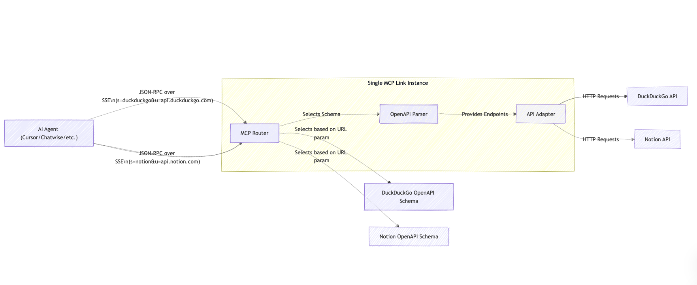

# MCP Link - Seamlessly Integrate Any API with AI Agents


## 🧩 Architecture



## 🤔 Why MCP Link?

There is a notable gap in the current AI Agent ecosystem:

- Most MCP Servers are simple wrappers around Web APIs
- Functionality interfaces may not be complete, depending on developer implementation
- Manual creation of MCP interfaces is time-consuming and error-prone
- Lack of standardized conversion processes

MCP Link solves these issues through automation and standardization, allowing any API to easily join the AI-driven application ecosystem.


## 🌟 Key Features

- **Automatic Conversion**: Generate complete MCP Servers based on OpenAPI Schema
- **Seamless Integration**: Make existing RESTful APIs immediately compatible with AI Agent calling standards
- **Complete Functionality**: Ensure all API endpoints and features are correctly mapped
- **Zero Code Modification**: Obtain MCP compatibility without modifying the original API implementation
- **Open Standard**: Follow the MCP specification to ensure compatibility with various AI Agent frameworks


## 🌐 Online Version

Try our hosted version at [mcp-link.vercel.app](https://mcp-link.vercel.app) to quickly convert and test your APIs without installation.


## 🚀 Quick Start

### Installation

```bash
# Clone repository
git clone https://github.com/automation-ai-labs/mcp-link.git
cd mcp-openapi-to-mcp-adapter

# Install dependencies
go mod download
```

### Running

```bash
# Specify port
go run main.go serve --port 8080 --host 0.0.0.0
```


### Parameter Description

- `s=` - URL of the OpenAPI specification file
- `u=` - Base URL of the target API
- `h=` - Authentication header format, in the format of `header-name:value-prefix`
- `f=` - Path filter expressions to include or exclude API endpoints. Syntax:
  - `+/path/**` - Include all endpoints under /path/
  - `-/path/**` - Exclude all endpoints under /path/
  - `+/users/*:GET` - Include only GET endpoints for /users/{id}
  - Multiple filters can be separated by semicolons: `+/**:GET;-/internal/**`
  - Wildcards: `*` matches any single path segment, `**` matches zero or more segments

### Examples
| _ | API | MCP Link URL | Authentication Method |
|------|-----|-------------|---------|
|  | Brave Search | https://mcp-link.vercel.app/links/brave | API Key |
|  | DuckDuckGo | https://mcp-link.vercel.app/links/duckduckgo | None |
|  | Figma | https://mcp-link.vercel.app/links/figma | API Token |
|  | GitHub | https://mcp-link.vercel.app/links/github | Bearer Token |
|  | Home Assistant | https://mcp-link.vercel.app/links/homeassistant | Bearer Token |
|  | Notion | https://mcp-link.vercel.app/links/notion | Bearer Token |
|  | Slack | https://mcp-link.vercel.app/links/slack | Bearer Token |
|  | Stripe | https://mcp-link.vercel.app/links/stripe | Bearer Token |
|  | TMDB | https://mcp-link.vercel.app/links/tmdb | Bearer Token |
|  | YouTube | https://mcp-link.vercel.app/links/youtube | Bearer Token |

### Usage in AI Agents

```json
{
  "mcpServers": {
    "@service-name": {
      "url": "http://localhost:8080/sse?s=[OpenAPI-Spec-URL]&u=[API-Base-URL]&h=[Auth-Header]:[Value-Prefix]"
    }
  }
}
```

These URLs allow any API with an OpenAPI specification to be immediately converted into an MCP-compatible interface accessible to AI Agents.

## 📋 Future Development

- **MCP Protocol OAuthflow**: Implement OAuth authentication flow support for MCP Protocol
- **Resources Support**: Add capability to handle resource-based API interactions
- **MIME Types**: Enhance support for various MIME types in API requests and responses
